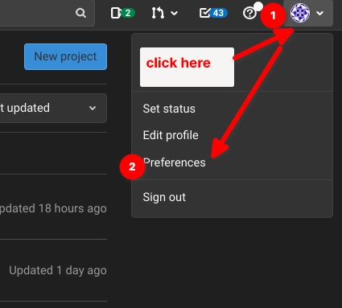
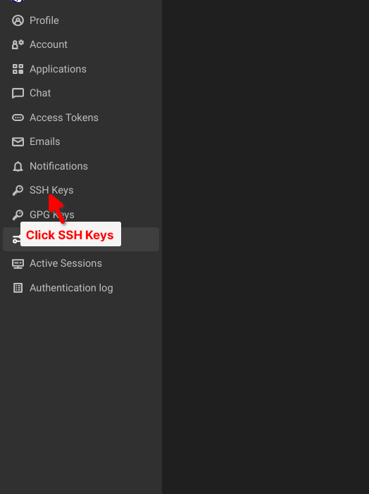

# Setup Development Environment

Setup development environment before starting to install this project.

## Create SSH Key

Type in terminal:
```sh
ssh-keygen -t ed25519 -C "<your-ekino-email>"
```

Press Enter. Output similar to the following is displayed:

```sh
Generating public/private ed25519 key pair.
Enter file in which to save the key (/home/user/.ssh/id_ed25519):
```

Enter to accept where ssh key will be saved.

Specify a passphrase in next step (optional):
```sh
Enter passphrase (empty for no passphrase):
Enter same passphrase again:
```

Enter to finish.

2 files will be generated:

- `/home/user/.ssh/id_ed25519`
- `/home/user/.ssh/id_ed25519.pub`

## Add SSH Key to Gitlab

Copy the content of your public key file (file `id_ed25519.pub`):

In **macOS** you can run this command to copy:
```sh
tr -d '\n' < ~/.ssh/id_ed25519.pub | pbcopy
```

Then go to Gitlab settings:



Go to SSH Key setting:




In the Key box, paste the contents of your public key. If you manually copied the key, make sure you copy the entire key, which starts with ssh-ed25519 or ssh-rsa, and may end with a comment.


Verify that you can connect to Gitlab:

Open a terminal and run this command, replacing gitlab.example.com with your GitLab instance URL:

```sh
ssh -T git@gitlab.example.com
```

If this is the first time you connect, you should verify the authenticity of the GitLab host. If you see a message like:

```sh
The authenticity of host 'gitlab.example.com (35.231.145.151)' can't be established.
ECDSA key fingerprint is SHA256:HbW3g8zUjNSksFbqTiUWPWg2Bq1x8xdGUrliXFzSnUw.
Are you sure you want to continue connecting (yes/no)? yes
Warning: Permanently added 'gitlab.example.com' (ECDSA) to the list of known hosts.

Type yes and press Enter.
```

Run 
```sh
ssh -T git@gitlab.example.com
```

You should receive msg `Welcome to GitLab, @username! message.`

## Install Git

**macOS**:

Check if already have git installed:
```sh
git --version
```

If git is already installed, you will see something similar to

```sh
git version 2.25.1
```

If you see that message, it means git already installed. If not, follow next steps to install git:

Install Homebew:

```sh
/bin/bash -c "$(curl -fsSL https://raw.githubusercontent.com/Homebrew/install/HEAD/install.sh)"
```

Follow instructions in terminal, press Enter until finish.

Use Homebrew to install Git:

```sh
brew install git
```

After finish, run `git --version` again to verify installation succeeds.

## Install ZSH & oh-my-zsh

Use Homebrew to install `zsh`
```sh
brew install zsh
```

Then run:

```sh
chsh -s /usr/local/bin/zsh
```

Logout and Login again.

Install `oh-my-zsh`:


```sh
sh -c "$(curl -fsSL https://raw.githubusercontent.com/ohmyzsh/ohmyzsh/master/tools/install.sh)"
```

Or:
```sh
sh -c "$(wget -O- https://raw.githubusercontent.com/ohmyzsh/ohmyzsh/master/tools/install.sh)"
```

## Install Node

Run
```sh
curl -o- https://raw.githubusercontent.com/nvm-sh/nvm/v0.39.1/install.sh | zsh
```

Or following if the above error:
```sh
wget -qO- https://raw.githubusercontent.com/nvm-sh/nvm/v0.39.1/install.sh | zsh
```

Then open `.zshrc` file to edit:
```sh
nano ~/.zshrc
```

Copy following lines and paste to `.zshrc` just opened:
```
export NVM_DIR="$([ -z "${XDG_CONFIG_HOME-}" ] && printf %s "${HOME}/.nvm" || printf %s "${XDG_CONFIG_HOME}/nvm")"
[ -s "$NVM_DIR/nvm.sh" ] && \. "$NVM_DIR/nvm.sh" # This loads nvm
```

Use `cmd + c` and then `cmd + y` to exit and save.

Logout and login again to make sure new installation is applied.

Run `nvm install <node-version>` to install Node.
Example this will install Node 14:
```sh
nvm install 14
```

Verify by running `node -v` to show current node version.
You should see something like:
```sh
v14.18.1
```

Install `yarn`:
```sh
npm install -g yarn
```

Verify by `yarn --version`

# Install Docker-in-vagrant
Some projects need special environment setup, for example some backend need to run in `linux`. Docker allows to re-create those environment fast. However, Docker can be slow to worked with in macOS.

To solve this, we install Docker in a Vagrant machine. 

Vagrant machine is a Ubuntu (linux) virtual machine. And we run docker inside that instead of running it directly in macOS.

We will work in this virtual machine instead of macOS for some projects.

Install:
1) Install Vagrant
```sh
brew install vagrant
```
2) Install vagrant-disksize plugin:
```sh
vagrant plugin install vagrant-disksize
```

3) Install Virtualbox https://www.virtualbox.org/

4) Clone this project: https://gitlab.ekino.com/francois.barrailla/docker-in-vagrant
```sh
git clone git@gitlab.ekino.com:francois.barrailla/docker-in-vagrant.git ~/docker-in-vagrant`
```

5) Go inside the cloned directory, run `vagrant up` and wait until finish

6) Run `vagrant ssh-config`, copy the config shown in terminal and paste into file `~/.ssh/config`, example:

    - Open file `~/.ssh/config` to edit in terminal:
    ```sh 
    nano ~/.ssh/config
    ```
    - Paste the config into `~/.ssh/config` file
    - `cmd+X` to close and `shit+Y` to save the file.

7) Open VS Code and install Remote - SSH extension.

8) Run `cmd + shift + p`, search `Remote-SSH: Connect to Host...`, choose `default` to connect to Vagrant machine. VSCode will open new window that run in Vagrant.

9) Create a SSH key for Vagrant machine and add it to Gitlab, similar to what we did in main macOS. Check https://docs.gitlab.com/ee/ssh/#generate-an-ssh-key-pair for detail.

10) Clone any projects that need to run in Vagrant and start working normally.

11) **Note**: When you want to start to work on your project again later (after break, after shutdown machine, etc.), remember to repeat step (5) (`vagrant up` inside where you cloned the repo `docker-in-vagrant` to start vagrant) and step (8) to connect your VS Code to Vagrant machine.


# Install project

Run yarn to install project
```sh
yarn
```

Start project:
```sh
yarn start
```
# Gitlab PR commit convention

Commit convention: `<type>(<scope>): <commit message>`

Example of `types` are:
- `fix`: bug fix
- `feat`: implement new feature

`scope` usually is Jira ticket number.

`commit message` can be Jira title.

For example, `fix(JD-1): Wrong tasks left number`

# Common Git workflow:

1) Clone repository: `git clone <repo>`
2) Checkout main branch to work from: `git checkout <main-branch>`. Main branch can be branch `master`, `main`, `develop` or `dev`, etc. depends on project.
3) Create a branch for your task `git checkout -b <task-jira-id>`
4) After finish, `git add .` to add all changes made or `git add <changed-file>` to add a changed file.
5) Commit those changes with `git commit -m <commit-msg>`
6) Push your commit to remote `git push -u origin <your-branch-name>`
7) Create merge request from your branch to the main branch you checkout-ed from and wait for it to be merged
8) After it's merged, checkout main branch and pull the latest updates: `git pull --ff-only origin <main-branch>`
9) Repeat at step 3) to start your new task.